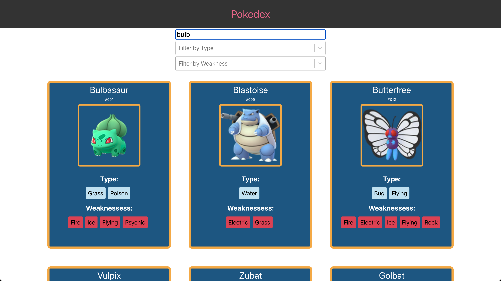

### This project was bootstrapped with [Create React App](https://github.com/facebook/create-react-app).
### Available Scripts
In the project directory, you can run:
### `npm start`
Open [http://localhost:3000](http://localhost:3000) to view it in the browser.

# This project connects to a pokemon API which then displays all pokemon data.

## I also implemented a fuzzy search to narrow results

## as well as filters by type and weakness which work in conjuction with each other. If you wanna find a pokemon with the type water, who also has a weakness to flying...

## or all pokemon of the type flying...

## and a details page that shows all available information as well as the next and previous evolutions (if any)...

### This project was a learning experience with Reacts context api as well. I had not used it before and found it to be incredible. Making it so easy to pass data around and is something I am continuing to work with in other projects.

